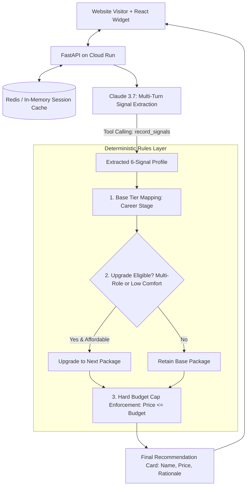

# 💼 Resume Recommendation Agent — Conversational Intake & Guardrail Playbook
PLAYBOOK.md — Multi-Turn Intake, Deterministic Decision Rules & Budget Cap SOP

This playbook defines the architecture, 6-signal extraction schemas, deterministic decision rules, and hard budget cap enforcement for the **Resume Recommendation Agent**.

---

## 1. 💼 Executive Overview & Business Case

### The Problem
Professional resume writing companies spend **10–15 minutes per customer intake call** explaining package options to visitors who don't know what service level they need. If an AI or sales rep accidentally recommends an expensive package beyond a customer's stated budget, it damages brand trust and triggers refund disputes.

### The Automated Solution
A conversational intake assistant built on the core principle: **"The LLM proposes; the rules dispose."**
* **Claude 3.7 / 3.5 Language Layer**: Engages visitors in a natural intake conversation, extracting 6 structured signals via tool calling (`record_signals`).
* **Deterministic Rules Layer**: A Python decision engine picks the best service package, tests genuine upgrade eligibility, and enforces the customer's budget as a **hard, unbreakable code-level ceiling**.

### Quantified ROI & Value
* **Intake Automation**: Handles 100% of front-line package discovery conversations automatically.
* **Zero Upsell Drift**: Guarantees zero refunds from accidental over-budget recommendations.
* **Serverless Cost**: Scales to zero on Cloud Run with in-memory / Redis session persistence.

---

## 2. 🏗️ System Architecture & Intake Sequence



---

## 3. 📋 Standard Operating Procedures (SOP)

### SOP-01: The 6 Required Intake Signals
The conversation must collect all 6 structured dimensions before a decision is triggered:
1. `career_stage`: `"entry"` | `"mid"` | `"senior"` | `"executive"`
2. `target_roles`: Specific target job titles or industry domains.
3. `timeline`: `"urgent"` | `"weeks"` | `"exploring"`
4. `budget`: Integer USD maximum comfort ceiling.
5. `prior_resume_work`: `"none"` | `"diy"` | `"professional"`
6. `self_promotion_comfort`: `"low"` | `"medium"` | `"high"`

### SOP-02: Base Tier Assignment
* **Executive / C-Suite**: Starts at **Executive ($699)** (Full rewrite, multi-role targeting, strategy call).
* **Senior / Lead**: Starts at **Professional ($349)** (Resume, cover letter, LinkedIn refresh).
* **Entry / Mid-Level**: Starts at **Essentials ($149)** (Polished single-version resume).

### SOP-03: Honest Upgrade Evaluation
A candidate is offered an upgrade to the next tier *only* if:
* They are targeting **2+ distinct roles** (needs multi-version tailoring), OR
* They report **low comfort writing about themselves** (strategy call provides high value), AND
* The higher package is **strictly at or under their stated budget**.

### SOP-04: The Hard Budget Cap Override
```python
if not _affordable(chosen, signals.get("budget")):
    chosen = _best_affordable(signals.get("budget"))
```
The budget cap is applied **last** so that it overrides all previous decision paths.

---

## 4. 🛡️ Guardrails, Security & Anti-Drift Standards

* **No LLM Decision Power**: The model is forbidden from recommending packages or quoting prices in its conversational reply.
* **Stateless Cloud Run Deployment**: Ephemeral containers ensure zero state leakage between distinct visitor sessions.
* **Resilient Session Fallback**: Connects to Redis when available, falling back to an in-memory session cache when running in isolated test environments.

---

## 5. 🚨 Exception Handling & Edge Cases

| Scenario | System Action | Resolution |
| :--- | :--- | :--- |
| **Budget Lower Than Cheapest Package (<$149)** | Recommends Essentials ($149) with budget note | Explains minimum entry tier and includes free DIY resume guide. |
| **Off-Topic Visitor Query** | AI intake redirects back to career goals | "I'd love to help with your resume! What target roles are you exploring?" |
| **Session Inactivity (>24 Hours)** | Redis key automatically expires | Clean session reset with zero stale memory. |

---

## 6. 🚀 Deployment & Operational Checklist

- [ ] **Dependencies**: `pip install -r backend/requirements.txt`.
- [ ] **Environment**: Set `ANTHROPIC_API_KEY` and optional `REDIS_URL` in `.env`.
- [ ] **Automated Testing**: Run `pytest tests/` (tests hard budget caps and upgrade paths).
- [ ] **Launch Server**: `python app.py` (serves web UI on `http://localhost:8000`).

---

## 7. 💬 Stakeholder FAQ

**Q: Why shouldn't Claude just pick the package in its chat reply?**  
*A: Prompt instructions can drift or be jailbroken by clever inputs. By separating extraction (LLM) from decision-making (Python math), we ensure the customer's budget is mathematically guaranteed in code.*

**Q: Can we embed this widget into an existing WordPress / Webflow site?**  
*A: Yes! The repository includes both an embedded React component (`frontend/ChatWidget.jsx`) and a standalone browser interface (`frontend/index.html`).*
