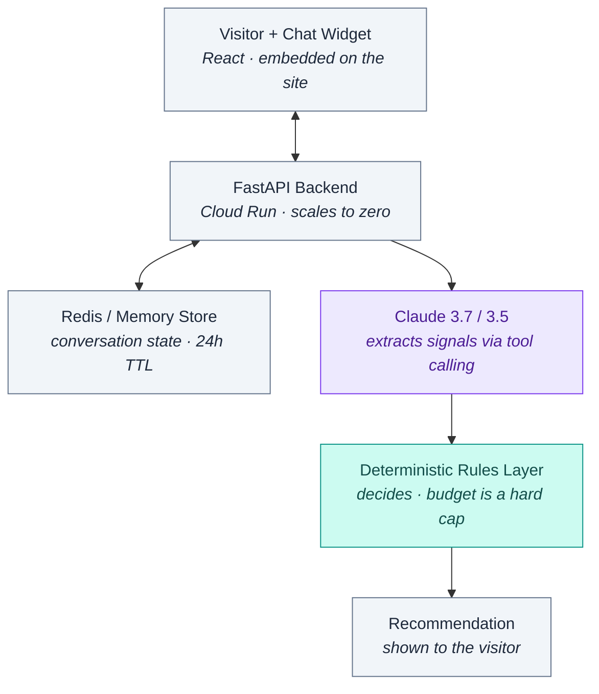

# 💼 Resume Service Recommendation Agent

[](https://www.python.org/)
[](https://fastapi.tiangolo.com/)
[](https://www.anthropic.com/)
[](LICENSE)

A conversational intake assistant that lives on a resume-writing company's website, asks the visitor structured intake questions, and recommends the service package that fits them best — **with a deterministic rule that it can never recommend a package above the visitor's stated budget.**

Built with **React**, **FastAPI**, **Anthropic Claude**, and **Redis** (with local in-memory fallback).

---

## 🏗️ Architecture: *"The LLM Proposes; The Rules Dispose"*



### Why this design principle matters:
Claude is excellent at holding a natural intake conversation and pulling structured signals out of user responses. **However, the LLM does not make the final recommendation.** 

A deterministic Python rules layer picks the package, and the visitor's stated budget is enforced in code as a **hard, unbreakable cap**. An LLM that occasionally upsells someone past their stated budget isn't a prompt tuning problem — it's a refund-and-trust liability.

---

## 🌟 Key Features & Highlights

1. **Multi-Turn Signal Extraction**:
   * Uses Anthropic tool calling (`record_signals`) to extract 6 key dimensions:
     - `career_stage` (entry, mid, senior, executive)
     - `target_roles` (specific job titles)
     - `timeline` (urgent, weeks, exploring)
     - `budget` (integer USD comfort ceiling)
     - `prior_resume_work` (none, diy, professional)
     - `self_promotion_comfort` (low, medium, high)
2. **Deterministic Budget Cap & Upgrade Logic**:
   * Analyzes honest upgrade fit (e.g. multi-role targeting or low self-promotion comfort), and strictly applies the budget cap last to ensure 100% compliance.
3. **Dual-Mode Execution**:
   * **Live AI Mode**: Connected to Anthropic Claude (`claude-3-7-sonnet-20250219`).
   * **Zero-Config Offline Mode**: Built-in intelligent heuristic signal extractor for local development and CI/CD testing without requiring an API key.
4. **Embedded React Widget & Standalone Portal**:
   * Includes both a production React component (`frontend/ChatWidget.jsx`) and a standalone interactive web portal (`frontend/index.html`).

---

## 🚀 Quick Start & Installation

### 1. Clone & Install Dependencies
```bash
git clone https://github.com/amandahervol-alt/Resume-Agent-.git
cd Resume-Agent-
pip install -r backend/requirements.txt
```

### 2. (Optional) Configure Live Claude API Key
Copy `.env.example` to `.env` to enable live Claude reasoning:
```env
ANTHROPIC_API_KEY=sk-ant-your-key-here
ANTHROPIC_MODEL=claude-3-7-sonnet-20250219
```
*(If no API key or Redis server is configured, the application runs seamlessly in zero-config local demo mode with in-memory session caching).*

### 3. Launch Local Server & Web Interface
```bash
python app.py
```
Open **`http://localhost:8000`** in your browser!

### 4. Run Automated Pytest Suite
```bash
python -m pytest tests/
```

---

## 📂 Repository Structure

```
Resume-Agent-/
├── backend/
│   ├── main.py          # FastAPI app, Redis/Memory session cache, endpoints
│   ├── extraction.py    # Claude tool-calling & signal extraction layer
│   ├── rules.py         # Deterministic decision tree + hard budget cap
│   └── requirements.txt # Backend dependencies
├── frontend/
│   ├── ChatWidget.jsx   # Embedded React chat widget component
│   └── index.html       # Standalone interactive browser interface
├── tests/
│   └── test_rules.py    # Pytest automated test suite (budget caps & upgrades)
├── app.py               # Standalone server & CLI runner
├── AGENTS.md            # Antigravity AI Orchestration Architecture
├── LICENSE              # MIT License
├── .env.example         # Environment configuration template
└── README.md            # Technical architecture overview
```

---

## 📄 License

This project is licensed under the [MIT License](LICENSE).
